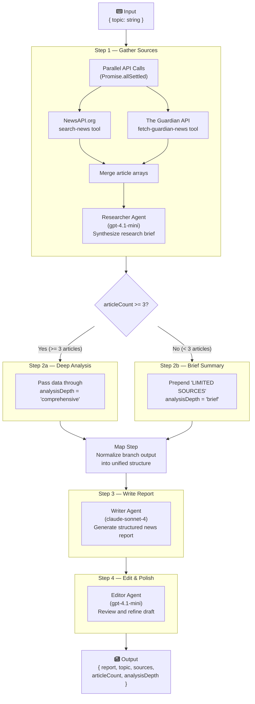
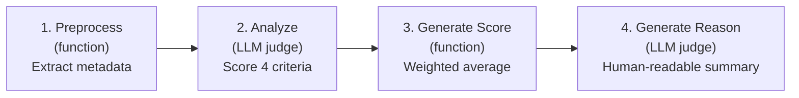

# Aperture — News Report Workflow

## Workflow Diagram



---

## Overview

The **news-report-workflow** is a 5-step, multi-agent pipeline built with [Mastra AI](https://mastra.ai). Given a news topic as input, it produces a polished, source-attributed news report by orchestrating three specialized agents and two external news APIs.

**Workflow ID:** `news-report-workflow`

| Input | Output |
|-------|--------|
| `{ topic: string }` | `{ report: string, topic: string, sources: Array<{title, url, source}>, articleCount: number, analysisDepth: string }` |

---

## Step-by-Step Breakdown

### Step 1 — Gather Sources (`gather-sources`)

**Purpose:** Fetch articles from two news APIs and produce a synthesized research brief.

**File:** `src/mastra/workflows/news-report.ts` (lines 11-60)

#### What happens:

1. **Parallel API calls** — The step calls both `searchNewsTool` and `fetchGuardianNewsTool` simultaneously using `Promise.allSettled()`. Each tool receives the user's topic as the search query and requests up to 5 articles. Using `allSettled` (rather than `all`) ensures that if one API fails, the workflow continues with results from the other.

2. **Merge results** — Articles from both sources are collected into a single `articles[]` array. Each article conforms to the `ArticleSchema`:
   ```typescript
   {
     title: string
     description: string | null
     source: string           // e.g. "Reuters" or "The Guardian - Technology"
     url: string
     publishedAt: string
   }
   ```

3. **Researcher Agent analysis** — The merged articles are formatted into a text summary (one line per article with title, source, date, and description) and sent to the **Researcher Agent**. The agent produces a structured research brief highlighting key themes, notable facts, and source attribution.

#### Data out:
```typescript
{
  topic: string
  articles: Article[]
  articleCount: number        // total articles from both APIs
  researchBrief: string       // researcher agent's synthesized analysis
}
```

#### Tools used:

| Tool | API | Auth | Endpoint |
|------|-----|------|----------|
| `search-news` | NewsAPI.org | `NEWS_API_KEY` header | `GET /v2/everything` |
| `fetch-guardian-news` | The Guardian | `GUARDIAN_API_KEY` query param | `GET /search` |

Both tools accept `{ query: string, pageSize: number }` and return `{ articles: Article[], totalResults: number }`.

**NewsAPI** sorts by relevancy and filters to English-language articles. **The Guardian API** orders by relevance and includes the `trailText` field as the article description.

---

### Step 2 — Conditional Branch

**Purpose:** Adjust the analysis depth based on how many articles were gathered.

**File:** `src/mastra/workflows/news-report.ts` (lines 238-242)

The workflow uses Mastra's `.branch()` primitive to evaluate the article count:

```typescript
.branch([
  [async ({ inputData }) => inputData.articleCount >= 3, deepAnalysisStep],
  [async () => true, briefSummaryStep],  // fallback
])
```

Branches are evaluated top-to-bottom. The first matching condition executes; the fallback (`true`) catches everything else.

#### Step 2a — Deep Analysis (`deep-analysis`)

**Condition:** `articleCount >= 3`

Passes data through unchanged and sets `analysisDepth` to `'comprehensive'`. This tells downstream steps to produce a thorough, multi-angle report.

#### Step 2b — Brief Summary (`brief-summary`)

**Condition:** Fallback (fewer than 3 articles)

Prepends `"LIMITED SOURCES AVAILABLE."` to the research brief and sets `analysisDepth` to `'brief'`. This signals downstream steps to produce a focused, concise report.

#### Data out (both branches):
```typescript
{
  topic: string
  researchBrief: string       // possibly prefixed with "LIMITED SOURCES AVAILABLE."
  articles: Article[]
  articleCount: number
  analysisDepth: 'comprehensive' | 'brief'
}
```

---

### Map Step — Normalize Branch Output

**Purpose:** Unify the output from whichever branch executed into a single data structure.

**File:** `src/mastra/workflows/news-report.ts` (lines 243-250)

After a `.branch()`, Mastra wraps the result in an object keyed by step ID. The `.map()` step extracts the actual result:

```typescript
.map(async ({ inputData }) => {
  const result = inputData['deep-analysis'] ?? inputData['brief-summary']
  if (!result) {
    throw new Error('No branch result')
  }
  return result
})
```

This ensures subsequent steps receive a flat object regardless of which branch ran.

---

### Step 3 — Write Report (`write-report`)

**Purpose:** Transform the research brief into a professional, structured news report.

**File:** `src/mastra/workflows/news-report.ts` (lines 120-176)

#### What happens:

1. **Build prompt** — The step constructs a prompt for the Writer Agent containing:
   - A **depth instruction** — either "Write a comprehensive, in-depth news report" (comprehensive) or "Write a concise news brief" (brief)
   - The topic
   - The research brief from the Researcher Agent
   - A formatted list of all available sources with titles, outlets, and URLs

2. **Writer Agent generates report** — The Writer Agent (powered by **Claude Sonnet 4**, the premium model chosen for user-facing output quality) generates the report following its instructions:
   - Neutral, journalistic tone
   - Leads with the most newsworthy finding
   - Structured as: **Headline → Lead paragraph → Body (2-4 paragraphs) → Sources section**
   - Inline source citations (e.g., "according to The Guardian")

3. **Extract source metadata** — The step maps the input articles into a simplified sources array `{ title, url, source }` for structured output.

#### Data out:
```typescript
{
  topic: string
  draft: string               // the generated news report
  sources: Array<{ title: string, url: string, source: string }>
  articleCount: number
  analysisDepth: string
}
```

---

### Step 4 — Edit & Polish (`edit-report`)

**Purpose:** Review the draft for quality, accuracy, and neutrality, then produce the final polished report.

**File:** `src/mastra/workflows/news-report.ts` (lines 180-219)

#### What happens:

1. **Editor Agent review** — The draft, topic, and analysis depth are sent to the **Editor Agent**. The editor evaluates the draft against six criteria:

   | Criterion | What it checks |
   |-----------|---------------|
   | **Accuracy** | All claims supported by cited sources |
   | **Neutrality** | No bias, opinion, or editorializing |
   | **Completeness** | Key aspects of the topic are covered |
   | **Structure** | Logical flow: headline → lead → body → conclusion |
   | **Source attribution** | Every factual claim attributed to a source |
   | **Clarity** | Accessible language for a general audience |

2. **Direct improvements** — The editor makes improvements inline and returns the polished report in the same format. It does not add editor notes or commentary.

#### Data out (final workflow output):
```typescript
{
  report: string              // the final polished report
  topic: string
  sources: Array<{ title: string, url: string, source: string }>
  articleCount: number
  analysisDepth: string
}
```

---

## Agents

### Researcher Agent

| Property | Value |
|----------|-------|
| **ID** | `researcher-agent` |
| **Model** | `openai/gpt-4.1-mini` |
| **Tools** | `search-news`, `fetch-guardian-news` |
| **File** | `src/mastra/agents/researcher.ts` |

Operates in two modes:
- **Standalone** (Mastra Studio / direct chat): Uses its tools to search for articles, then synthesizes findings.
- **Workflow** (called from a step): Analyzes pre-fetched articles passed in the prompt without calling tools.

Produces a structured research brief with key findings, themes, notable quotes/data, and full source attribution.

### Writer Agent

| Property | Value |
|----------|-------|
| **ID** | `writer-agent` |
| **Model** | `anthropic/claude-sonnet-4-20250514` |
| **Tools** | None |
| **File** | `src/mastra/agents/writer.ts` |

Transforms research into a professional news report. Uses Claude Sonnet 4 as the premium model for user-facing output quality. Follows strict journalistic guidelines: neutral tone, inline citations, structured format (Headline, Lead, Body, Sources).

### Editor Agent

| Property | Value |
|----------|-------|
| **ID** | `editor-agent` |
| **Model** | `openai/gpt-4.1-mini` |
| **Tools** | None |
| **File** | `src/mastra/agents/editor.ts` |

Reviews and polishes drafts against a 6-point quality checklist. Makes improvements directly without adding commentary. Returns the report in the same format it received.

---

## Quality Scorer

**File:** `src/mastra/scorers/report-quality.ts`

The `reportQualityScorer` evaluates finished reports through a 4-phase pipeline using `gpt-4.1-nano` as the judge model:



### Phase 1 — Preprocess
Extracts metadata from the report text: word count, paragraph count, whether a headline exists, number of source attributions (phrases like "according to"), and URL count.

### Phase 2 — Analyze
Sends the report text and metadata to the LLM judge, which scores four criteria from 0.0 to 1.0:

| Criterion | What it measures |
|-----------|-----------------|
| **Source Attribution** | Named sources, diversity, URL references |
| **Neutrality** | Objective tone, balanced perspectives, no editorializing |
| **Completeness** | Topic coverage, missing angles |
| **Structure** | Headline, lead, body, sources section flow |

### Phase 3 — Generate Score
Computes a weighted average:

```
score = sourceAttribution × 0.3
      + neutrality         × 0.2
      + completeness       × 0.3
      + structure          × 0.2
```

Result is rounded to 2 decimal places (range: 0.00 to 1.00).

### Phase 4 — Generate Reason
Produces a 2-3 sentence human-readable summary of the evaluation, highlighting strengths and areas for improvement.

---

## Model Selection Strategy

The workflow uses a multi-provider approach optimizing cost vs. quality:

| Component | Model | Cost / 1M tokens | Rationale |
|-----------|-------|-------------------|-----------|
| Researcher | `openai/gpt-4.1-mini` | ~$1.60 | Extraction & summarization — cost-efficient |
| Writer | `anthropic/claude-sonnet-4` | ~$15.00 | User-facing output — premium quality |
| Editor | `openai/gpt-4.1-mini` | ~$1.60 | Rule-based refinement — cost-efficient |
| Scorer | `openai/gpt-4.1-nano` | ~$0.40 | Structured JSON evaluation — minimal cost |

---

## Environment Variables

| Variable | Used by | Purpose |
|----------|---------|---------|
| `ANTHROPIC_API_KEY` | Writer Agent | Claude Sonnet 4 API access |
| `OPENAI_API_KEY` | Researcher, Editor, Scorer | GPT-4.1 mini/nano API access |
| `NEWS_API_KEY` | `search-news` tool | NewsAPI.org authentication |
| `GUARDIAN_API_KEY` | `fetch-guardian-news` tool | The Guardian API authentication |
